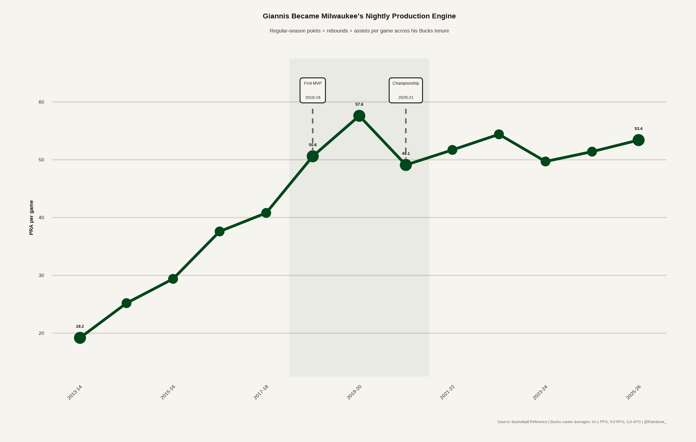
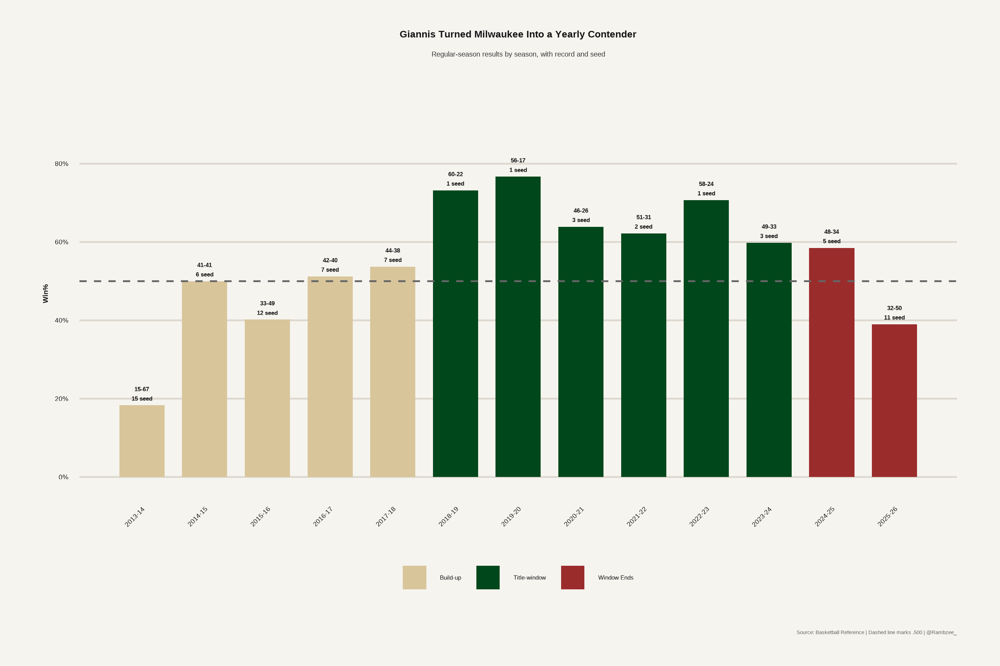

```{r setup}
library(tidyverse)
library(gt)
library(scales)

source("../scripts/00_setup.R")

giannis_stats <- read_csv("../data/processed/giannis_stats_clean.csv", show_col_types = FALSE)
team_results <- read_csv("../data/processed/bucks_team_results_clean.csv", show_col_types = FALSE)
playoffs <- read_csv("../data/processed/bucks_playoff_results_clean.csv", show_col_types = FALSE)
transactions <- read_csv("../data/processed/transaction_timeline_clean.csv", show_col_types = FALSE)
future_picks <- read_csv("../data/processed/future_picks_clean.csv", show_col_types = FALSE)
current_roster <- read_csv("../data/processed/current_roster_clean.csv", show_col_types = FALSE)
young_pieces <- read_csv("../data/processed/young_pieces_clean.csv", show_col_types = FALSE)
draft_prospects <- read_csv("../data/processed/draft_prospects_clean.csv", show_col_types = FALSE)
on_off <- read_csv("../data/processed/giannis_on_off_clean.csv", show_col_types = FALSE)
```

# Introduction

Milwaukee's Giannis era was one of the defining small-market success stories of the modern NBA. Giannis Antetokounmpo arrived as a raw, high-upside prospect, developed into an MVP and Finals MVP, and became the organizing principle for the franchise. The Bucks built around his force, physicality, defensive range, and transition pressure, and that bet reached its peak with the 2021 championship.

The post-Giannis phase starts from a different place. Milwaukee is no longer trying to maximize one of the league's best players in real time. It is trying to turn the end of that era into enough young talent, draft capital, and financial flexibility to avoid a long dead period.

This report treats the reset as both an opportunity and a constraint. The Bucks added young players and future Miami picks, but the roster is not a blank slate and the future pick map is still shaped by prior win-now decisions.

# The Giannis Arc

```{r}

```

Giannis' development changed the scale of what Milwaukee could reasonably expect from a season. The early years were about discovery and role growth. By the late 2010s, the Bucks had shifted into a different category entirely: every roster decision was judged by whether it helped convert Giannis' prime into a title.

```{r}
on_off |>
  gt() |>
  tab_header(
    title = "Giannis On/Off Since First MVP",
    subtitle = "A simple snapshot of how Milwaukee performed with and without its franchise anchor"
  ) |>
  cols_label(
    status = "Status",
    minutes = "Minutes",
    ortg = "ORTG",
    drtg = "DRTG",
    net = "Net",
    two_fg_pct = "2FG%",
    three_fg_pct = "3FG%",
    opp_two_fg_pct = "Opp 2FG%",
    opp_three_fg_pct = "Opp 3FG%"
  ) |>
  fmt_number(columns = c(minutes), decimals = 0) |>
  fmt_number(columns = c(ortg, drtg, net), decimals = 1) |>
  fmt_percent(
    columns = c(two_fg_pct, three_fg_pct, opp_two_fg_pct, opp_three_fg_pct),
    decimals = 1
  ) |>
  gt_bucks_theme()
```

# Milwaukee's Team-Level Rise and Decline

```{r}

```

```{r}
knitr::include_graphics("../outputs/figures/bucks_team_ratings_trend.png")
```

The Bucks did not just have one great season. They built a multi-year baseline of regular-season strength around Giannis, Middleton, Lopez, Holiday, and eventually Lillard. The issue was not that the Giannis era failed. The issue was that the later versions of the roster had fewer ways to adapt once age, injuries, salary, and pick obligations started narrowing the path.

# Playoff Results

```{r}
knitr::include_graphics("../outputs/figures/playoff_results_timeline.png")
```

The playoff record tells the shape of the era more clearly than one ending does. Milwaukee broke through in 2021, but the seasons after the title became increasingly defined by injuries, matchup problems, and the cost of trying to keep the window open.

```{r}
playoffs |>
  select(season, round_reached, result, opponent, record, notes) |>
  gt() |>
  tab_header(
    title = "Bucks Playoff Results",
    subtitle = "Postseason outcomes during the Giannis era"
  ) |>
  cols_label(
    season = "Season",
    round_reached = "Round",
    result = "Result",
    opponent = "Opponent",
    record = "Series",
    notes = "Notes"
  ) |>
  gt_bucks_theme()
```

# Window-Shaping Moves

```{r}
knitr::include_graphics("../outputs/figures/transaction_timeline.png")
```

Milwaukee's roster-building path was aggressive because it had to be. Small-market contenders usually do not get many clean chances at a title. The Jrue Holiday trade was expensive, but it helped produce a championship. The Damian Lillard trade was similarly aggressive, but the timing and roster balance never fully created a second peak.

```{r}
transactions |>
  transmute(
    date,
    season,
    move = transaction_type,
    outgoing = players_out,
    incoming = players_in,
    picks_out,
    picks_in,
    notes
  ) |>
  gt() |>
  tab_header(
    title = "Major Transaction Timeline",
    subtitle = "Draft, trade, and roster moves that shaped the Giannis era and reset"
  ) |>
  cols_label(
    date = "Date",
    season = "Season",
    move = "Move",
    outgoing = "Players Out",
    incoming = "Players In",
    picks_out = "Picks Out",
    picks_in = "Picks In",
    notes = "Notes"
  ) |>
  fmt_date(columns = date, date_style = "yMMMd") |>
  sub_missing(columns = everything(), missing_text = "") |>
  gt_bucks_theme()
```

# Current Roster and New Core

```{r}
knitr::include_graphics("../outputs/figures/roster_age_distribution.png")
```

```{r}
knitr::include_graphics("../outputs/figures/new_core_role_map.png")
```

The new roster has more optionality than certainty. Tyler Herro gives Milwaukee a proven scoring bridge. Kel'el Ware, Jaime Jaquez Jr., Kasparas Jakucionis, Brayden Burries, Nate Ament, Ryan Rollins, Ousmane Dieng, AJ Green, and Andre Jackson Jr. give the Bucks several different development bets, but not a direct replacement for Giannis.

```{r}
young_pieces |>
  select(player, player_type, ppg, rpg, apg, ts_pct, usg_pct, mpg) |>
  gt() |>
  tab_header(
    title = "Young NBA Pieces",
    subtitle = "Recent production for Milwaukee's young and bridge pieces"
  ) |>
  cols_label(
    player = "Player",
    player_type = "Role Label",
    ppg = "PPG",
    rpg = "RPG",
    apg = "APG",
    ts_pct = "TS%",
    usg_pct = "USG%",
    mpg = "MPG"
  ) |>
  fmt_number(columns = c(ppg, rpg, apg, mpg), decimals = 1) |>
  fmt_percent(columns = c(ts_pct, usg_pct), decimals = 1) |>
  gt_bucks_theme()
```

```{r}
draft_prospects |>
  select(
    player, prospect_type, ppg, rpg, apg, tov,
    two_fg_pct, three_fg_pct, ft_pct, mock_pos
  ) |>
  gt() |>
  tab_header(
    title = "Incoming Draft Prospects",
    subtitle = "Manual prospect production snapshot"
  ) |>
  cols_label(
    player = "Player",
    prospect_type = "Prospect Type",
    ppg = "PPG",
    rpg = "RPG",
    apg = "APG",
    tov = "TOV",
    two_fg_pct = "2FG%",
    three_fg_pct = "3FG%",
    ft_pct = "FT%",
    mock_pos = "Mock Position"
  ) |>
  fmt_number(columns = c(ppg, rpg, apg, tov), decimals = 1) |>
  fmt_percent(columns = c(two_fg_pct, three_fg_pct, ft_pct), decimals = 1) |>
  gt_bucks_theme()
```

# Future Pick Control

```{r}
knitr::include_graphics("../outputs/figures/future_pick_control.png")
```

The reset is real, but it is not clean. Milwaukee added future Miami upside, including incoming firsts and a swap path, but the 2027-30 window is still affected by prior obligations. That matters because a normal rebuild depends on controlling the downside. Milwaukee has more young talent than before, but it cannot treat every losing season as equally productive.

```{r}
future_picks |>
  select(
    year, round, status, bucks_pick_result,
    outgoing_to, incoming_from, report_label
  ) |>
  gt(groupname_col = "year") |>
  tab_header(
    title = "Future Pick Control",
    subtitle = "Incoming upside, retained picks, and remaining constraints"
  ) |>
  cols_label(
    round = "Round",
    status = "Status",
    bucks_pick_result = "Bucks Pick Result",
    outgoing_to = "Outgoing To",
    incoming_from = "Incoming From",
    report_label = "Report Label"
  ) |>
  sub_missing(columns = everything(), missing_text = "") |>
  gt_bucks_theme()
```

# Early Takeaway

Milwaukee is not replacing Giannis. It cannot. The real question is whether the Bucks converted the end of his era into enough flexible paths to build the next one.

The strongest version of the reset probably requires more than one thing to hit. Herro has to stabilize the offense without blocking the younger players. Ware or another frontcourt prospect has to become a real defensive piece. At least one of the draft swings needs to become more than a rotation player. The future Miami picks need to matter. And the front office has to avoid treating a retool like a finished core too early.

# Methodology

This report uses manually verified public data files for core transaction, roster, draft, playoff, and team-season information. Manual entry was used where source tables were small, stable, and easier to audit than fragile web scraping.

Current data sources include Basketball Reference, ESPN roster information, RealGM pick tracking, NBA transaction reporting, and manually compiled player/prospect tables. This version should be treated as a public-data report. Playtype, private tracking, and paid lineup sources are excluded unless explicitly noted.
